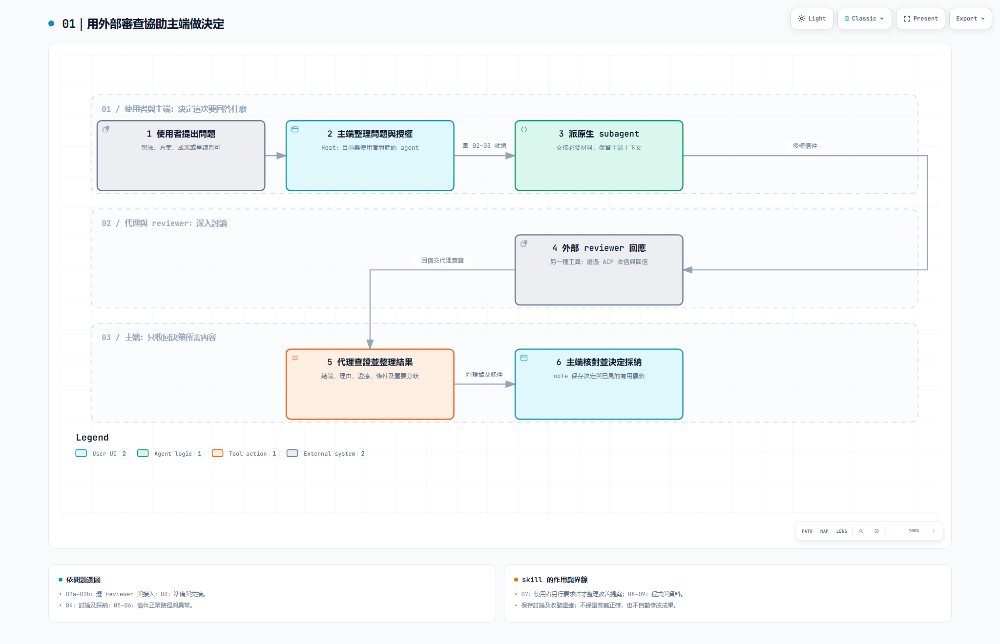

# Review collaboration｜代理協作審查

[English](README.md) · [完整圖解](docs/diagrams/review-collaboration-guide-20260913/README.md) · [技能入口](skills/review-collaboration/SKILL.md)

讓外部 AI reviewer 審查想法、方案、成果或有爭議的問題，同時讓主端保留精簡、有用的上下文。原生 subagent 負責深入討論、查證重要主張，再帶回結論、理由、證據、條件及未解分歧；主端決定是否採用。

這是一套 **Windows agent skill，附 ACP 收發工具**。完整 Markdown 信件及收發證據保存在本機專案紀錄，不要求共識、不固定問答輪數，也不自動修改你的成果。

[](docs/diagrams/review-collaboration-guide-20260913/01-overview.html)

README 顯示靜態預覽。GitHub 會顯示 HTML 原始碼，不直接執行圖稿；請下載或 clone 專案，再在本機開啟 [中文導覽頁](docs/diagrams/review-collaboration-guide-20260913/index.html) 或 [英文導覽頁](docs/diagrams/review-collaboration-guide-20260913/en/index.html)。兩種語言各有 12 張圖，支援縮放、搜尋及明暗切換，涵蓋接入、審查、異常恢復、改善與程式工具。

## 適合什麼情況

- 做決定前，檢查假設或比較可能改變選擇的替代方案。
- 根據實際證據與限制，審查成果或建議。
- 討論尚未定案的想法，不必先編出一個方案或強求同意。

主端必須能派出真正的原生 subagent，每輪使用一名不同 agent 工具的外部 reviewer。同一工具換模型仍屬同工具自審。

## 使用條件

| 條件 | 需要準備什麼 |
| --- | --- |
| Windows 環境 | PowerShell 5.1、.NET Framework 編譯器及 Node.js。已測基準為 Node v24.18.0，其他版本需另行核對。 |
| 主端 agent | 能讀取 skill、呼叫本機工具，並派出真正的原生 subagent。主端不需要 ACP server。 |
| 外部 reviewer | 已安裝的 agent、可用的登入狀態，以及原生 ACP 或經核對的相容 adapter。一般 CLI 能啟動不代表 ACP 可用。 |
| ACP 路線 | 核對實際入口、版本、設定及可接觸／外送的資料。發現候選、握手、登入、完整回信是不同證據。 |
| 本機儲存 | 可寫入的一般本機目錄，支援 NTFS hard link；拒絕 UNC／reparse 路徑。專案紀錄不能放在 skill 套件內。 |
| 模型使用權限 | 由你選擇的 reviewer 使用其帳號／API 設定與計費方式。本專案不附憑證或模型額度。 |

ACP 是 Agent Client Protocol，包內程式充當 client，在同一連線收發審查文字。reviewer 安裝與個人登入授權使用該 agent 的官方流程。不需要全域 hook、Herdr 或 agency-agents；Archify 只在重新產生圖稿時需要，使用 skill 或閱讀現有 HTML 不需要安裝它。

## 準備與安裝

將專案 clone 到一般本機目錄，再安裝已鎖定的依賴：

```powershell
git clone https://github.com/JuiMingWang/review-collaboration.git
Set-Location .\review-collaboration\skills\review-collaboration
npm.cmd ci --ignore-scripts
```

完整技能位於 **`skills/review-collaboration/`**，不是儲存庫根目錄。用主端支援的技能機制註冊這個資料夾，或明確請主端讀取 clone 位置內的 `SKILL.md`。若主端要求放入指定技能目錄，請複製這個完整資料夾，並在安裝位置準備依賴；不要直接覆蓋既有安裝，也不要帶入別人的私人設定。

請主端依 [首次接入指引](skills/review-collaboration/references/first-connection.md) 核對選定 reviewer 的路線、必要的登入方法與合成回信。有效路線會沿用，普通使用不會自動下載 adapter 或每次額外呼叫模型測試。缺少前置條件時保留草稿，停止送信。

若你使用過本儲存庫舊版根目錄的 v1，請保留舊安裝與原紀錄，讓進行中的工作使用原版結束。本次沒有提供 v1 狀態自動遷移；舊檔案仍可從 Git 歷史查閱。

## 開始使用

例如對主端說：

> 請讀取 `skills/review-collaboration/SKILL.md`，用這套流程審查我的方案。可以比較有具體依據、可能改變選擇的替代方案；本次送審材料限定為這份方案及我列出的來源檔案。

沒有已存偏好時，主端會請你選一名 reviewer；每次說明選擇、設定及實際送出的材料，已涵蓋的授權會沿用。

1. **主端準備：**釐清問題；已有方案就附理由，先提供會改變判斷的背景，界定可讀與可外送資料。
2. **代理討論：**送信、先查授權來源、比較重要替代案。只有缺少的貢獻可能改變判斷才續談；必要的主端問題集中詢問。
3. **代理回報：**每個重要問題與疑慮都有理由或明示未解；保留證據、條件與分歧，完整信件留在紀錄。
4. **主端採納：**核對完成證據與重要結論，接受、部分接受或拒絕，保存理由。`reply-ready` 表示收信證據完整，不代表內容正確或已採納。

## 工具各自做什麼

| 工具／模組 | 用途 |
| --- | --- |
| `scripts/review-mail.ps1` | Windows JSON 入口，管理本次呼叫、程序期限、清理與完成核對。 |
| `scripts/review-mail.mjs` | 驗證請求並分派下列 12 個 action。 |
| `reviewer-profile.mjs`／`acp-route.mjs` | reviewer 選擇、版本衝突、路線身分、候選發現與接入證據。 |
| `acp-client.mjs`／`mail-exchange.mjs` | ACP 握手、登入、session 文字、單次送信、取消與回信證據。 |
| `mail-store.mjs`／`mail-contract.mjs`／`safe-files.mjs` | 專案／議題／run 紀錄、不可變信件、IDs、雜湊及本機路徑檢查。 |
| `invoke-process.ps1`／`ProcessTransport.cs` | 控制 Windows 程序期限，清理本次呼叫的程序樹。 |
| `windows-lock.mjs` 與 lock helper | 原子短鎖，避免多個寫入者同時覆蓋紀錄。 |
| `argv-launcher.mjs` 與 launcher helper | adapter 只能接 executable 路徑、無法傳必要 CLI 參數時使用的可選橋接工具。 |
| `tests/run-offline.mjs`／`tests/run-windows.ps1` | 重現收發契約與 Windows 行為檢查；不證明審查品質。 |
| `scripts/export-clean.ps1` | 只輸出白名單內 48 個來源檔與雜湊清單，不執行發布。 |

以上路徑相對技能資料夾；未標目錄的模組位於 `scripts/lib/`，`invoke-process.ps1` 位於 `scripts/`。

| action | 用途 |
| --- | --- |
| `resolve`、`profile-set` | 讀取已存選擇，或明確更新預設。 |
| `authenticate`、`probe` | 查看／呼叫登入方法；核對握手或已授權的合成往返。 |
| `project-init`、`topic-create`、`run-open` | 建立本機紀錄，固定本輪 reviewer、路線、設定及期限。 |
| `exchange` | 封存並送出一封已授權信件；重呼叫同一 exchange 不會重寄。 |
| `status`、`cancel`、`recover` | 查看證據、要求取消，或核對原結果並補完成紀錄；缺證據仍保留未知。 |
| `note` | 保存採納及其他主端註記；前提改變會增加議題版本。 |

詳見 [完整工具對照](docs/diagrams/review-collaboration-guide-20260913/TOOLS.md) 與 [JSON 呼叫契約](skills/review-collaboration/references/mail-records.md)。普通審查由 agent 建立請求，使用者不必手寫 JSON。

## 紀錄、隱私與持續改善

信件與採納紀錄放在各專案的 `.review-collaboration/`；路線、偏好、編譯工具與執行收據放在已安裝技能的 `_private/`。這些資料、憑證及 `node_modules` 都不應公開。本機可讀不等於可送 reviewer；另設工作目錄也不是讀取隔離。詳見 [資料界線](skills/review-collaboration/references/data-boundaries.md)。

普通審查只保存已經看到的有用觀察，不會每輪另做效果分析。使用者要求維護時，agent 才整理相關證據，提出不改、刪除、合併、改寫或新增的具體方案，集中決定採用。歸因前先確認資訊當時可取得、且可能改變判斷；不因結果不好就直接加規則。這不是背景自我改寫，也不保證每次修改都更好。

## 版本與驗證範圍

本次為 **R11（2026-09-13）**，helper 的 package 版本仍為 `0.1.0`；R11 表示文件與來源快照，不是 npm 發布版本。相較 R10，流程只補強重要疑慮覆蓋與維護時的歸因，收發行為及依賴版本未改。

測試入口與指令見 [套件 README](skills/review-collaboration/README.md#verify-and-share)，相容性宣稱需依 [驗證層級與限制](skills/review-collaboration/references/verification.md)。圖稿另有 [驗證摘要](docs/diagrams/review-collaboration-guide-20260913/VALIDATION.md)；圖形檢查通過不能證明 token 更少、零資訊流失或每個任務都判斷正確。

## 授權

[MIT](LICENSE)。產生的圖稿 Viewer 另保留 [Archify 授權](docs/diagrams/review-collaboration-guide-20260913/ARCHIFY-LICENSE.txt)。
