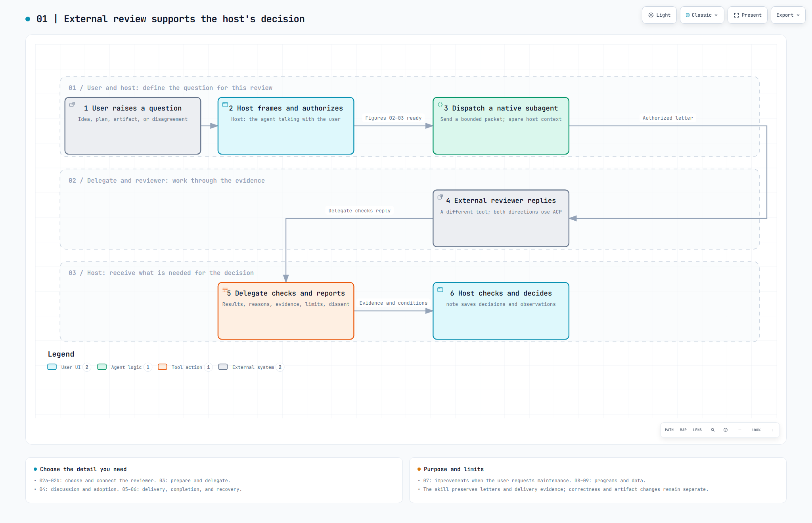

# Review collaboration: a visual guide for new readers

[繁體中文](../README.md) · [Open the gallery](index.html) · [Tool map](TOOLS.md)

This Windows skill asks a different agent tool to review an idea, plan, artifact, or disagreement. The **host** is the agent talking to the user. Its native **subagent (delegate)** works through the review with an external **reviewer**. The host receives the conclusions, reasons, supporting evidence, conditions, and dissent needed for adoption; full correspondence stays in project records.

## Reading the 12 diagrams

Start with 01 → 02a → 02b when setup is needed → 03 → 04a → 04b. Read 05a → 05b → 06 to understand delivery and recovery; 07 for maintenance; 08 → 09 for program functions and sharing boundaries. Numbers belong to each diagram. **05a and 05b are consecutive parts of one exchange**, not two reviewer rounds.

| Topic | Diagram | What it explains | Preview |
| --- | --- | --- | --- |
| A | Overview | [What the collaboration does](01-overview.html) | From the user question to delegated discussion and host adoption: meet the four roles. | [PNG](01-overview.png) |
| B | Agent setup | [Check capabilities and choose a reviewer](02a-selection.html) | Check native subagents, reject same-tool review, and determine whether saved route evidence is still valid. | [PNG](02a-selection.png) |
| B | Agent setup | [First connection and necessary rechecks](02b-connection.html) | Verify the endpoint, material scope, handshake, login, and synthetic reply; each proves something different. | [PNG](02b-connection.png) |
| C | Review workflow | [Prepare material and delegate](03-handoff.html) | Define the letter and disclosure boundary; establish project, topic, and run before the bounded handoff. | [PNG](03-handoff.png) |
| C | Review workflow | [Verify, follow up, or stop](04a-discussion.html) | Check authorized sources first. Continue only for a consequential gap; group necessary questions for the host. | [PNG](04a-discussion.png) |
| C | Review workflow | [Check the result and decide adoption](04b-adoption.html) | Account for material issues, preserve reasons and evidence, reassess changed premises, and record adoption. | [PNG](04b-adoption.png) |
| C | Review workflow | [How the program sends and receives](05a-send.html) | Steps 1–6: JSON entry, immutable archive, unknown delivery before prompting, and the ACP reply stream. | [PNG](05a-send.png) |
| C | Review workflow | [How the program establishes completion](05b-finalize.html) | Steps 7–12: clean up the process tree and correlate original evidence; reply-ready is not adoption. | [PNG](05b-finalize.png) |
| C | Review workflow | [Failure, cancellation, and continuity](06-recovery.html) | Distinguish status, recover, and cancel. Never resend unknown delivery; rebuild lost native context explicitly. | [PNG](06-recovery.png) |
| D | Improvement | [Propose changes from evidence](07-improvement.html) | Only on requested maintenance: compare no change, deletion, merging, and rewriting; decide as a batch and stop. | [PNG](07-improvement.png) |
| Tools and records | [Program modules and their functions](08-programs.html) | From the PowerShell entry to Node dispatch, mail operations, ACP client, records, and checks. | [PNG](08-programs.png) |
| Tools and records | [Helpers and data locations](09-support-and-data.html) | Locks, optional argument launcher, tests, export, private records, and the shareable package. | [PNG](09-support-and-data.png) |

Each HTML diagram opens independently with zoom, search, and theme controls. PNGs provide GitHub previews, and the matching JSON is the editable Archify source. GitHub does not run the HTML viewer; download this directory or clone the repository and open index.html locally. Read the full-size diagram rather than relying only on thumbnails.

## Boundaries to understand

- A native subagent has its own runtime work context; a role described in prose is insufficient. The bundled program is the ACP client, so the host needs no ACP server.
- The reviewer must be a different tool. Choosing a reviewer does not authorize sending the entire conversation or all readable local files.
- ACP transports both directions of text. Reply content, stop reason, process cleanup, and correlated receipts are checked separately. reply-ready does not establish correctness.
- Ordinary reviews retain useful observations already seen, without an extra evaluation pass. User-requested maintenance produces concrete proposals for batch adoption; there is no background skill rewrite.
- The skill folder includes its own sources. Windows, PowerShell, Node, .NET Framework, native host delegation, and a usable reviewer installation/authentication/ACP route remain prerequisites.

## Sources and limits

These diagrams explain R11 behavior; they do not add runtime actions or policies. See [source coverage](SOURCE-MAP.md) and [validation evidence](VALIDATION.md). Diagram checks do not establish real review quality, token savings, or zero information loss.

The English diagrams preserve the Chinese diagrams' roles, decisions, and sources, with layout and concise wording adapted for English. Supporting cards and this guide retain qualifications. Viewers were generated with Archify 2.17; its [license](../ARCHIFY-LICENSE.txt) is included. Raw browser receipts and private paths are excluded from the public package.
